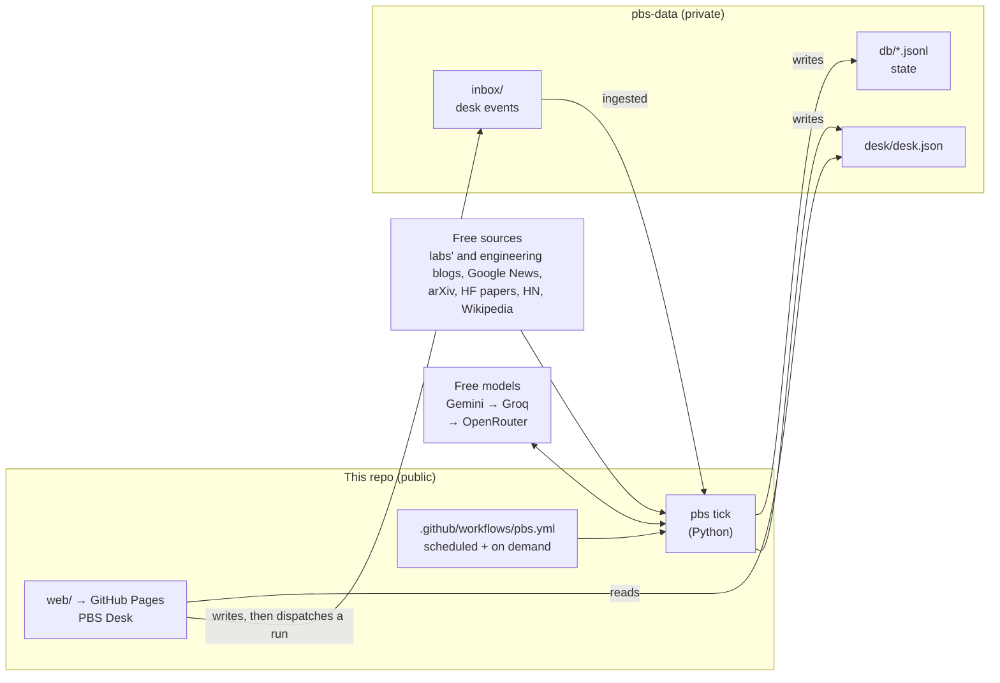

# Personal Brand System (PBS)

A $0, self-learning system that scouts topics every day and has **2–3 LinkedIn and 4–6 X drafts** waiting for
Ankit by about 6am Melbourne time. He picks, edits and posts them himself; the system learns from what he
picks, what he changes and how the posts perform.

- **Never posts for you.** No auto-posting, liking, replying or messaging. You copy, open the app, post, and tap *Posted*.
- **Never makes things up.** Every figure is checked against the sources; your experiences come only from your answers (cards with questions arrive drafted from recent sources, and answering is optional); opinions on public issues only from stances you recorded.
- **Keeps work private.** A blocklist (your employer, clients, colleagues, internal systems) blocks drafts before you see them and is redacted from every model call.
- **Costs nothing.** GitHub Actions, GitHub Pages, free model tiers (Gemini, Groq) and free news sources.

The full product spec is [docs/PRD.md](docs/PRD.md). Setup takes about 15 minutes: [docs/SETUP.md](docs/SETUP.md).
Day-to-day operation and fixes: [docs/RUNBOOK.md](docs/RUNBOOK.md).

## How it works



Every run is an idempotent **tick** that does whatever is due: ingest the desk's events, finish work you're
waiting on (answers, rewrites, requests), deliver the morning set, prepare the Saturday batch, run the weekly
review, learn, and export `desk.json`. A missed schedule is caught up by the next run of any kind.

**Learning, in short:** Thompson sampling over pillar × format per platform (rewards relative to your own
median, 6-week half-life, 20% exploration); a voice profile from your edit diffs (phrases you keep cutting
become "never use"); a weekly reflection that writes a versioned playbook with evidence and reversal
conditions; experiments that get promoted or retired on their pick rate; and a weekly system report that
fixes small things itself and proposes the rest for your approval.

## The desk

A React PWA (installable on your phone) at `https://<you>.github.io/<this repo>/`. No server: it reads
`desk.json` from your private data repo and writes events to `inbox/` with a fine-grained token that stays in
your browser. Actions show instantly and work offline; the pipeline confirms them on its next run.

Board · card editor (editable hooks, live checks, thread tools, rewrite, adapt to the other platform, optional
questions, dictation) · Requests (the search says what it understood) · Stances · Metrics (screenshot upload,
review queue, check-in) · Insights (charts, playbook, proposals, weekly report, voice, the skip reasons the
ranking uses) · Sources · History · Settings · System.

**Try it before setup:** open the desk and choose *Explore the demo first*. The demo data is generated by the
real pipeline running offline (`pbs demo`): three simulated weeks of deliveries, edits, posts, metrics and
weekly reviews, then a fresh morning.

## Repository layout

| Path | What's there |
| --- | --- |
| `pbs/` | The pipeline: `tick.py` (orchestrator), `scout/`, `topics.py`, `rank.py`, `bandit.py`, `draft.py`, `guardrails.py`, `learn.py`, `voice.py`, `reflect.py`, `report.py`, `metrics.py`, `llm/`, `export.py`, `contracts.py` (the desk contract) |
| `pbs/defaults/` | Default settings, sources, stances, voice rules, interview questions and the profile template |
| `pbs/prompts/` | Versioned prompt templates |
| `pbs/demo/` | Offline world (mock feeds + demo model) and the demo builder |
| `web/` | PBS Desk (React 19, TypeScript, Vite, Tailwind) |
| `scripts/` | Data checkout/push for Actions, schedule keep-alive |
| `tests/`, `web/src/**/*.test.ts`, `web/tests/` | Python tests, desk unit tests, end-to-end tests |

## Development

```bash
# Pipeline
python -m venv .venv && . .venv/bin/activate && pip install -e ".[dev]"
pytest && ruff check pbs tests
pbs tick --offline --data .pbs-local        # a full run against mock feeds and a fake model
pbs demo                                    # demo data for the desk -> web/public/demo/desk.json

# Desk
cd web && npm ci
npm run demo-data && npm run dev            # http://localhost:5173, choose "Explore the demo first"
npm run typecheck && npm test && npm run build && npm run e2e
```

The desk's types are generated from the pipeline's contract: after changing `pbs/contracts.py`, run
`pbs schema` and `npm run gen:types` (CI fails if the schema is stale).
