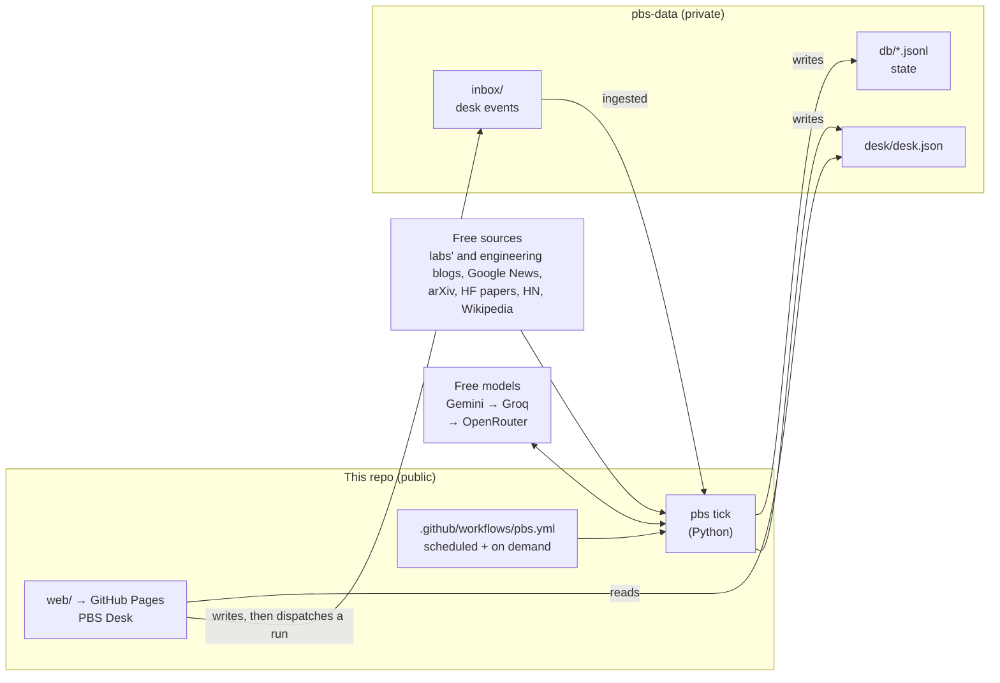

# Personal Brand System (PBS)

A $0, self-learning system that scouts topics every day and has **2–3 LinkedIn and 4–6 X drafts** waiting for
Ankit by about 6am Melbourne time. He picks, edits and posts them himself; the system learns from what he
picks, what he changes and how the posts perform.

- **Never posts for you.** No auto-posting, liking, replying or messaging. You copy, open the app, post, and tap *Posted*.
- **Never makes things up.** Every figure is checked against the sources; your experiences come only from your answers (cards with questions arrive drafted from recent sources, and answering is optional); opinions on public issues only from stances you recorded.
- **Sounds like you, not a model.** Drafts are written against the patterns that give AI writing away ("It's not X, it's Y", "Here's why:", em dashes, emoji bullets, filler, same-length sentences). A draft that still has some gets one more pass that rewrites only those sentences, and the new version is kept only if it has fewer and passes every check. The desk flags them as you type, Insights shows the trend, and a pattern you keep taking out becomes a rule.
- **Writes for each platform.** Drafts follow a guide to what works on LinkedIn and on X now, researched monthly and changed only with your approval. Each comes with hashtags to keep or drop and a first comment with the source link, and any card can be cross-posted or moved to the other platform.
- **Draws visuals, with AI pictures if you like.** A carousel, flowchart, comparison, numbered list, big number or quote card, written from the post and its sources and drawn by the desk in your style: PNG images, or a PDF to post on LinkedIn as a document. Every word can be edited, and figures the sources don't have are flagged. With a free Cloudflare key, an AI illustration for the post or an AI picture behind a cover, big number or quote (FLUX; Gemini and Grok as paid options). The picture never contains words: the desk draws them.
- **Keeps work private.** A blocklist (your employer, clients, colleagues, internal systems) blocks drafts before you see them and is redacted from every model call.
- **Costs nothing.** GitHub Actions, GitHub Pages, free model tiers (Gemini, Groq) and free news sources.

The full product spec is [docs/PRD.md](docs/PRD.md). Setup takes about 15 minutes: [docs/SETUP.md](docs/SETUP.md).
Day-to-day operation and fixes: [docs/RUNBOOK.md](docs/RUNBOOK.md).

## How it works



Every run is an idempotent **tick** that does whatever is due: ingest the desk's events, finish work you're
waiting on (answers, rewrites, cross-posts, requests), deliver the morning set, prepare the Saturday batch, run
the weekly review, research the platforms once a month, learn, and export `desk.json`. A missed schedule is caught up by the next run of any kind.

**Learning, in short:** Thompson sampling over pillar × format per platform (rewards relative to your own
median, 6-week half-life, 20% exploration); a voice profile from your edit diffs (phrases you keep cutting
become "never use", and so do AI tells you keep taking out; your posts with the fewest tells and the most of your
own words are the examples the drafter sees); a weekly reflection that writes a versioned playbook with evidence and reversal
conditions; experiments that get promoted or retired on their pick rate; which hashtags you keep and which cards you
move or copy to the other platform; and a weekly system report that fixes small things itself and proposes the
rest for your approval.

## The desk

A React PWA (installable on your phone) at `https://<you>.github.io/<this repo>/`. No server: it reads
`desk.json` from your private data repo and writes events to `inbox/` with a fine-grained token that stays in
your browser. Actions show instantly and work offline; the pipeline confirms them on its next run.

Board · card editor (editable hooks, hashtag chips, the first comment, visuals with PNG and PDF download, live
checks and platform tips, thread tools, rewrite, cross-post or move to the other platform, optional questions,
dictation) · Requests (the search
says what it understood) · Stances · Metrics (screenshot upload, review queue, check-in) · Insights (charts,
playbook, the platform guide and its research, proposals, weekly report, voice and how AI-sounding the drafts are,
the skip reasons and cross-posts the ranking uses, posts with and without a visual) · Sources · History · Settings · System.

**Try it before setup:** open the desk and choose *Explore the demo first*. The demo data is generated by the
real pipeline running offline (`pbs demo`): three simulated weeks of deliveries, edits, posts, metrics and
weekly reviews, then a fresh morning.

## Repository layout

| Path | What's there |
| --- | --- |
| `pbs/` | The pipeline: `tick.py` (orchestrator), `scout/`, `topics.py`, `rank.py`, `bandit.py`, `draft.py`, `hashtags.py`, `platform.py` (platform guide and research), `visuals.py`, `images.py` (AI images), `guardrails.py`, `learn.py`, `voice.py`, `reflect.py`, `report.py`, `metrics.py`, `llm/`, `export.py`, `contracts.py` (the desk contract) |
| `pbs/defaults/` | Default settings, sources, stances, the platform guide, voice rules, interview questions and the profile template |
| `pbs/prompts/` | Versioned prompt templates |
| `pbs/demo/` | Offline world (mock feeds + demo model) and the demo builder |
| `web/` | PBS Desk (React 19, TypeScript, Vite, Tailwind); `web/src/lib/visual/` lays out, draws and exports visuals |
| `scripts/` | Data checkout/push for Actions, schedule keep-alive |
| `tests/`, `web/src/**/*.test.ts`, `web/tests/` | Python tests, desk unit tests, end-to-end tests |

## Development

```bash
# Pipeline
python -m venv .venv && . .venv/bin/activate && pip install -e ".[dev]"
pytest && ruff check pbs tests
pbs tick --offline --data .pbs-local        # a full run against mock feeds and a fake model
pbs demo                                    # demo data for the desk -> web/public/demo/desk.json

# Desk
cd web && npm ci
npm run demo-data && npm run dev            # http://localhost:5173, choose "Explore the demo first"
npm run typecheck && npm test && npm run build && npm run e2e
```

The desk's types are generated from the pipeline's contract: after changing `pbs/contracts.py`, run
`pbs schema` and `npm run gen:types` (CI fails if the schema is stale).
