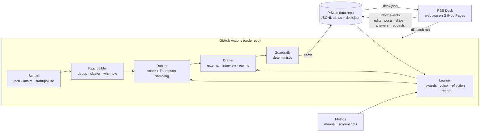

# PRD v2 — Personal Brand System (LinkedIn + X)

Sep 27, 2026 · @Ankit · v2, revised from v1 before the build

v1 set the right goal and the right constraints. This version keeps both and changes how the system gets there. It fixes the parts of v1 that would have cost the most in daily friction, privacy exposure and free-tier fragility. The build in this repo implements v2.

---

## What changed from v1, and why

| # | Area | v1 | v2 | Why |
|---|---|---|---|---|
| 1 | Front end | Four Notion databases, synced every two hours | **PBS Desk**: a web app built for picking, editing and posting, installable on a phone and hosted free on GitHub Pages | Rewrites, answers and requests come back in about two minutes, not up to two hours. The desk has a real X thread editor with weighted character counts, a LinkedIn "see more" fold marker, a live diff and edit ratio, one-tap copy and works offline. It avoids Notion's rate limits and 2,000-character property limits, and saves about 360 Actions minutes a month |
| 2 | Where data lives | SQLite in a private repo | The code repo can stay **public**. All personal state (drafts, answers, stances, metrics) lives in a **private data repo**, or on a `data` branch if the code repo is private | This repo is public today. v1 would have published every draft, interview answer and political stance. A public code repo also gets unlimited free Actions minutes and free Pages hosting |
| 3 | State format | One binary SQLite file, committed on every sync | JSON Lines tables (one row per line) loaded into in-memory SQLite for each run | Diffs are readable and the repo doesn't fill up with multi-megabyte binary versions. The desk can read the files, and concurrent writers can't corrupt them |
| 4 | Sync model | Poll Notion every two hours | Event-driven. The desk writes small event files to `inbox/`, and actions that need the model trigger a run straight away. Every run is a self-healing **tick** that catches up on whatever is due | GitHub delays, drops and cancels scheduled runs. With a tick, a missed morning run is recovered by the next run of any kind |
| 5 | LLM | Gemini free tier only | A **provider chain**: Gemini (models discovered at run time) → Groq (free key, recommended) → OpenRouter's free router (optional). Each task has its own route, personal inputs go to providers that don't train on prompts, and blocklist terms are redacted before any call | Free tiers change often: they were cut sharply in 2025, GitHub Models was retired in July 2026, and Gemini ships new Flash models every few months with per-model free quotas. Pinned model names break; discovered ones don't. A normal day needs about 15 to 25 calls, not 150 |
| 6 | Pipeline design | LLM summarises items in batches | **Deterministic first.** Dedup, clustering, why-now notes, scoring, guardrails and voice statistics run in code. The LLM triages the shortlist and writes drafts | Cheaper, testable and reproducible, and it survives quota cuts |
| 7 | Learning | Incremental bandit, generic signals | The bandit is recomputed from the signal log each run, with a six-week half-life. Skip reasons have defined meanings, expiries count only on days Ankit engaged, and the system learns which hook he keeps. Low-confidence hypotheses run as explicit experiments in exploration slots. Every card records the playbook, prompt and voice versions it was drafted with | Every learned number can be reproduced and audited. "Getting better" can be measured by version |
| 8 | Card lifecycle | All unpicked cards expire at the next delivery | News cards expire at the next delivery. Interview and evergreen cards last seven days, and Editing cards last 72 hours after the last touch. At most one Needs-input card per platform per day | Half-finished work and weekly batch cards shouldn't disappear overnight, and questions shouldn't pile up |
| 9 | Posting helpers | Paste final text into Notion | The final text is captured in the editor. The desk has per-post copy, compose links that prefill the text (Ankit still presses Post), and "Find on X" links for reply angles | Cuts the daily loop to pick → tweak → copy → post → one tap |
| 10 | Metrics | Screenshots only | A quick manual entry form, screenshot extraction with a review queue for low-confidence matches, and a weekly follower check-in | Screenshots are the riskiest input. Every number needs a fallback path |
| 11 | Reply angles | "Reply suggestions for larger accounts" | Reply angles on the day's biggest announcements, a watchlist of large accounts per lane, and a live X search link to find the thread | The system can't read X feeds without a paid API, so it points Ankit to the thread instead |
| 12 | Operations | Run log only | Push notifications when drafts are ready (ntfy or Telegram, both free), health warnings in the desk (stale runs, failing sources, quota, a disabled schedule), and `pbs doctor` to automate the Phase 0 checks | Silent failure is the most likely way the habit breaks |
| 13 | Weekly review | Fixed at Sunday 20:00 UTC, which is Monday morning in Melbourne | A "Run weekly review" button right after the Sunday screenshot upload, with a Monday-morning fallback | The review should reflect the screenshots Ankit just uploaded |
| 14 | Platform fit | One writing style for both platforms, no hashtags, links in the post | Drafts follow a **platform guide** (what works on LinkedIn and on X now, per format), researched monthly and changed only with Ankit's approval. Every draft comes with hashtags to keep or drop and a first comment carrying the source link. Any card can be **cross-posted** (keep both) or **moved** to the other platform, and both teach the ranker | LinkedIn and X reward different writing. Links in the post body reach fewer people on both, and what works changes every few months |
| 15 | Visuals | None | Carousels, flowcharts, comparisons, numbered lists, big numbers and quote cards, written by the model from the post and its sources and drawn by the desk as SVG, exported as PNG or a PDF carousel. No image model | A visual stops the scroll, and LinkedIn document carousels hold attention. Drawing in code keeps it free, on-brand, editable and checkable (figures are checked against the sources like any draft) |

Four contradictions in v1 are resolved as follows:

- **"Industry news, with a take" vs "never invents opinions".** External drafts may argue an *analytical angle*. It is shown on the card as the proposed angle, and Ankit adopts it only by posting it. Drafts never claim personal experience, and never take a side on a political or contested issue without a recorded stance.
- **Reply suggestions without reading feeds.** See change 11.
- **Firsthand and learning-in-public pillars (50% of LinkedIn) need Ankit's input.** These run in interview mode. The Saturday batch prepares the week's questions, and each weekday adds at most one Needs-input card per platform.
- **Reflection timing vs the Sunday session.** See change 13.

---

## Overview and goals

A $0, self-learning system that scouts topics every day, puts two or three LinkedIn drafts and four to six X drafts in front of Ankit each morning, and learns from his edits and post results.

The problem: posting daily on two platforms means finding topics, picking an angle and writing, on top of a full-time job. Generic AI-news posts won't build a reputation as a pioneer; firsthand, well-angled posts will.

**Goals**

1. Build LinkedIn authority in AI and automation, grounded in real work, while tracking the state of the art across new research, developments and industry news.
2. Grow @\_singhankit\_ on X as an open personal voice: tech, startups, life, and world, India and Bihar affairs.
3. Sustain daily posting on both platforms at about 20 to 30 minutes a day of Ankit's time.
4. Improve measurably over time: drafts need fewer edits and the topic mix shifts toward what works.

**Working name:** Personal Brand System (PBS). The web app is the **PBS Desk**.

## Non-goals and hard constraints

Four constraints are non-negotiable. Everything else in this PRD can change.

**Hard constraints**

- **$0 running cost.** No paid APIs, hosting or databases, and no credit card anywhere in the default setup. The only upgrade considered is a paid LLM, and only if draft quality stalls.
- **Manual posting.** The system never posts, likes, replies or messages on Ankit's behalf. It never stores platform credentials. Compose links only prefill text; Ankit presses Post.
- **No fabrication.** It never invents experiences, numbers, quotes or opinions. Figures, dates and historical claims come from sources on the card. Experiences and views come only from Ankit's answers and recorded stances.
- **Confidentiality.** Nothing that identifies employer internals, clients or colleagues. Current contract work is discussed only in general terms. Nothing personal goes into the public code repo or the public Actions logs, and blocklist terms are redacted before any LLM call.

**Non-goals for v1**

- Auto-posting or scheduling posts on the platforms.
- Instagram. That stays with Creator Agent, a separate system.
- Image or carousel generation. Drafts are text; the system may suggest a format.
- Reading LinkedIn or X feeds through paid APIs.
- More than one user.

## Success metrics

Brand metrics show whether reach is growing; system metrics show whether the machine is getting better at helping. Targets are proposals until baselines exist. The desk's Insights page tracks every row.

| Metric | Platform | Target (proposed) | Source |
| --- | --- | --- | --- |
| Followers gained per week | LinkedIn, X | 4-week average rising | Weekly check-in or screenshots |
| Profile views from posts | LinkedIn | 4-week average rising | Screenshots or manual entry |
| Comments and reposts per post | LinkedIn, X | Median rising | Screenshots or manual entry |
| Posting cadence | LinkedIn, X | 7 posts a week each | Desk |
| Daily hit rate (at least one card posted) | LinkedIn, X | 6 of 7 days by week 8 | Desk |
| Edit ratio (draft vs posted text) | LinkedIn, X | Falling week over week | Diff at posting |
| Editing time per post | LinkedIn, X | 10 minutes or less | Measured by the editor (active time) |
| Time from delivery to post | LinkedIn, X | Falling | Desk timestamps |
| Rank-1 pick rate | LinkedIn, X | Rising (the ranker learns his taste) | Desk |
| Rewrite rate | LinkedIn, X | Falling | Desk |
| Running cost | All | $0 a month | Run log |

Baseline, late September 2026: about 3,100 followers on LinkedIn and 12 on X.

## Content strategy

LinkedIn is focused: AI and automation, from a practitioner who also tracks the state of the art. X is broad and personal. The weights below are starting priors only. The learner moves them as evidence comes in. Pillars can split or merge, but only after Ankit approves a proposal.

### LinkedIn: AI and automation practitioner

| Pillar | What it covers | Mode | Starting weight |
| --- | --- | --- | --- |
| Firsthand receipts | What building automation in enterprise and financial services actually teaches, with identifying details removed | Interview | 30% |
| Research and state of the art | New papers, benchmarks, model and agent capabilities, and techniques moving from labs into practice, explained for people automating real work | External | 25% |
| Industry news, with a take | The whole AI and automation industry: labs and model releases, AI startups and funding, big-tech moves, enterprise adoption, regulation, compute and infrastructure, and automation vendors (Automation Anywhere, UiPath, Power Automate), each with a proposed analytical angle | External | 25% |
| Learning in public | Builds and experiments, including the FDE-track work: evals, agents, MCP | Interview | 20% |

Format: text posts up to 3,000 characters. The hook must land before LinkedIn's "see more" fold at about 210 characters, and the editor marks the fold. The system may suggest a carousel or poll, but drafts text only.

### X (@\_singhankit\_): open voice

| Lane | What it covers | Mode | Starting weight |
| --- | --- | --- | --- |
| Tech and AI | Faster, lighter takes than LinkedIn; threads welcome | External | 35% |
| World, India and Bihar affairs | History, developments, future prospects and Ankit's thoughts (see below) | External, or interview for opinions | 30% |
| Startups | Ecosystem news, founder lessons, market moves | External | 20% |
| Life | Personal observations and experiences | Interview only | 15% |

Formats: single post (280 weighted characters, or longer if Premium is switched on in settings), thread of 3 to 7 posts, quote-post angle, and reply angle. English only.

**Reply angles.** With 12 followers today, original X posts reach very few people. Until the account passes about 500 followers (configurable), two of each morning's X slots are reply angles on the day's biggest announcements. Each reply card carries:

- the reply text;
- a watchlist of large accounts likely to post about the topic (editable per lane);
- a live X search link that finds the thread to reply to.

The system can't see X feeds, so Ankit picks the thread himself.

### The affairs lane: more than politics

This lane covers how places got here, where they are, and where they are heading, at three levels with separate scouts: **world**, **India** and **Bihar**. Politics is one part of it, alongside economy, infrastructure, governance, society and culture. Four post types:

1. **History behind the news:** the background that explains a current event.
2. **Development tracker:** what actually changed, with sources and data.
3. **Future outlook:** where a trend is heading and what would change that.
4. **Opinion:** Ankit's view. Only drafted from a stance he has recorded or answers he gives (see Guardrails).

Every historical claim, date or figure carries a source link on the card. Bihar coverage includes Hindi outlets. Items are summarised in English and keep the original-language link.

Affairs stay on X. The exception is where they meet tech (AI regulation, digital public infrastructure); those can run on LinkedIn under Industry news. Until Ankit has picked a stance on an issue, affairs cards use the three non-opinion types.

## User workflow

Ankit's whole job is to pick, edit, post and occasionally answer questions; everything else happens without him.

| When | The system | Ankit | His time |
| --- | --- | --- | --- |
| Every morning, by about 6am Melbourne | Scouts, ranks and puts two or three LinkedIn cards and four to six X cards, all fully drafted, on the desk under **Suggested**, ranked best first. A push notification says they're ready | Picks one or more per platform and edits in the desk. Copies the text or uses the compose link, posts manually, then taps **Posted** (the final text is already captured) | About 20 to 30 min |
| When a topic needs him | Puts the card in **Needs input** with two or three questions (firsthand posts, life posts, affairs opinions), at most one per platform per day | Answers on the card by typing or dictating. A drafting run starts straight away, and the draft appears in about two minutes | 2 to 3 min |
| On demand | Searches any topic he adds under **Requests**, including sources beyond the daily lists, and returns full drafts | Adds the request; it runs immediately | 1 min |
| Saturday night | Prepares the week's evergreen and interview-mode cards | Nothing | None |
| Sunday | Weekly reflection runs when he taps **Run weekly review**, with a Monday-morning fallback | Batch session on the week's cards; drops analytics screenshots into **Metrics**, confirms any flagged numbers, reads the playbook changes and approves or rejects proposals | 60 to 90 min |
| Any time | Uses his recorded stances for affairs opinion drafts | Adds or updates a stance on the **Stances** page | As needed |

**Card lifecycle.** Suggested → Editing → Posted, or Skipped with a reason. Unpicked news cards expire at the next delivery and count as a quiet no, but only on days when Ankit acted on at least one card. A day he didn't open the desk teaches nothing. Interview, evergreen and request cards last seven days. Editing cards last 72 hours after the last touch.

Skipping a card with a reason counts as feedback, the same as posting one. Each reason has a defined effect:

| Skip reason | What the learner does |
| --- | --- |
| Not interesting | Negative signal for the topic and its pillar × format arm |
| Off-brand | Negative signal for the arm; the topic's keywords are down-weighted for that platform |
| Too risky | Negative signal for the arm; raises the sensitivity threshold for similar topics |
| Wrong timing | No arm update (the idea was fine); the topic can come back later |
| Already covered | No arm update; the topic joins the novelty filter |
| Other (asks why) | Weak negative for the arm; his reason is read by the next morning's ranking and the weekly reflection, and similar topics rank a little lower |
| Wrong platform (set by moving the card) | Mild negative for the original platform's arm only; the topic was right. The new card is learned from like any other |

**Cross-posting.** Any card can be made for the other platform: **Also for X** (or LinkedIn) keeps both cards, and **Move to X instead** (in the Skip menu, or the same dialog) skips the original as "wrong platform". The new card is rewritten for how that platform works, not trimmed, carries its own hashtags, and is delivered with the original's set so the ranker learns from it. Both moves and copies go into the next morning's ranking.

Any card can be sent back: tap **Rewrite** and add a note such as "shorter" or "sharper hook" (quick chips are provided). The redraft starts straight away. The note is logged as feedback for the voice profile.

## System architecture

Eight components form one loop. Scouts find topics, the ranker and drafter turn them into cards, and Ankit edits and posts in the desk. What he changes and how the post performs flows back into the next ranking and draft.

- **Code repo (public, this repo).** Code, default configuration and the desk app. It holds no personal data, and the Actions logs print counts and IDs, never content.
- **Data repo (private).** JSONL tables, `desk.json` for the desk, and `inbox/` for desk events. Only the pipeline writes tables; only the desk writes to `inbox/`. The single-writer rule means concurrent writes never conflict.
- **Runs.** One workflow with one concurrency group. It is triggered by a daily schedule, a Saturday schedule, three light ticks a day and dispatches from the desk. Every run is a tick that performs whatever is due, so no work depends on one particular run firing.

## Functional requirements

v1's 26 requirements are kept; changed ones are marked **(v2)**, and new ones start at FR-27. The phase column maps each one to the rollout plan below. Because the build ships everything at once, phases now describe when a capability is switched on and trusted, not when it's written.

| ID | Requirement | Phase |
| --- | --- | --- |
| **Scouting** |  |  |
| FR-1 **(v2)** | Pull items daily from configured free sources into the store, removing duplicates by canonical URL and by near-identical title across the last 7 days; use conditional requests (ETag/Last-Modified) | 1 |
| FR-2 | Run three scouts with separate source lists: tech (AI research and state of the art, plus industry news across AI and automation: labs, startups, funding, policy, vendor changelogs), affairs (world, India, Bihar), startups and life | 1 |
| FR-3 | Include Hindi outlets for Bihar; summarise in English and keep the original-language link | 1 |
| FR-4 **(v2)** | Group items into topics deterministically (TF-IDF clustering) and attach a why-now note (recency, number of sources, pace of coverage) | 1 |
| **Ranking** |  |  |
| FR-5 | Score each topic per platform on pillar or lane fit, timeliness, angle potential for Ankit, novelty against the last 30 days of posts, and learner weights | 1 |
| FR-6 | Reserve about 20% of slots for exploration: untested combinations of pillar, format and hook, and the experiments the weekly reflection proposes | 3 |
| **Drafting** |  |  |
| FR-7 **(v2)** | Deliver two or three LinkedIn cards and four to six X cards to the desk by about 6am Melbourne, all fully drafted and ranked best first, with at most one Needs-input card per platform per day | 2 |
| FR-8 | Each card holds: topic, why now, Ankit's angle, format, full draft, three alternative hooks (typed), sources | 2 |
| FR-9 | Two modes. External: draft fully from sources. Interview: for firsthand, learning-in-public, life and affairs-opinion posts, ask two or three questions and draft only from the answers | 2 |
| FR-10 | Affairs drafts use one of four types: history behind the news, development tracker, future outlook, opinion | 2 |
| FR-11 **(v2)** | X formats: single post, thread of 3 to 7, quote-post angle, reply angle (with watchlist and search link). LinkedIn: text post, with carousel or poll noted as a suggestion only | 2 |
| FR-12 | Every figure, date and historical claim links to a source on the card; unsourced claims are flagged, not published silently | 2 |
| **Delivery, search and requests** |  |  |
| FR-13 **(v2)** | The desk reads `desk.json` and writes events to `inbox/`. Status, edits, final text, skips, rewrites, answers, requests, stances, settings and metrics are ingested on the next run, and actions that need the model trigger a run immediately. The desk shows pending events straight away | 2 |
| FR-14 | A request on any topic triggers a fresh search and returns full drafts for the chosen platforms (default two LinkedIn, three X), each with sources | 2 |
| FR-15 | On-demand search reaches beyond the daily source lists: Google News RSS search, Hacker News search, arXiv, Wikipedia and Reddit search feeds, plus Gemini's Google Search grounding when the free tier allows it (checked by `pbs doctor`) | 2 |
| FR-16 | Any card can be sent back with a rewrite note; the redraft runs immediately and the note is logged as feedback | 2 |
| FR-17 | Saturday night: prepare the week's evergreen and interview-mode cards | 3 |
| **Learning** |  |  |
| FR-18 | On Posted: store the final text, compute the edit ratio against the draft, detect which hook was used, and record the post's features | 3 |
| FR-19 | Log every interaction as a signal: picks, skips (with reasons), expiries, edits, hook swaps, rewrites, answers, requests, time to post, editing time | 3 |
| FR-20 **(v2)** | Read analytics screenshots, match numbers to posts, and flag low-confidence matches for review in the desk; manual entry is always available | 3 |
| FR-21 | Update rewards per post; run a weekly reflection that writes a versioned playbook with evidence, confidence and a reversal condition for each change | 3 |
| FR-22 | Build the voice profile from edit diffs, starting on day one (deterministic statistics daily, LLM summary weekly) | 3 |
| FR-23 | Write a weekly system report (source yield, scout hit rate, ranker accuracy, drafter quality, guardrail catches, run health); apply source and candidate-count changes itself, propose everything else | 3 |
| **Guardrails and operations** |  |  |
| FR-24 | Run a deterministic blocklist check on every draft before delivery and on the final text at posting; block matches instead of rewording them | 2 |
| FR-25 | Draft affairs opinions only from recorded stances or interview answers | 2 |
| FR-26 **(v2)** | Log calls, tokens and quota use per run and provider. When a free limit is near, fall back to the provider's next model, then the next provider, then trim to fewer cards, then deliver brief cards with a **Draft this** button, and note it on the desk. When providers fail with errors rather than quota, deliver the full set as briefs, mark the run partial and say which provider failed and why | 1 |
| FR-27 | The desk is an installable, offline-capable web app. It covers the board, card editor, requests, stances, metrics, insights, sources, settings and system health, and needs only a fine-grained GitHub token kept in the browser | 1 |
| FR-28 | Every run is an idempotent tick that catches up on overdue work (morning delivery, weekly batch, reflection) | 1 |
| FR-29 | Notify Ankit when drafts or requested results are ready (ntfy or Telegram, optional, content-free messages) | 2 |
| FR-30 | `pbs doctor` checks every provider, source and secret, and reports free-tier limits it can observe | 0 |
| FR-31 | Redact blocklist terms from every LLM input and keep the public Actions logs free of personal content | 0 |
| FR-32 | Proposals that touch pillars, reward weights or guardrails wait for Ankit's approval in the desk; nothing else needs him | 3 |
| **Posting quality** |  |  |
| FR-33 | Every draft comes with hashtags kept apart from the text (LinkedIn 3 to 5, X none to 2 by default; configurable or off). The desk shows them as chips to keep, drop or add, and appends the kept ones when he copies, opens the app or marks the post posted. The learner records which he keeps, drops and adds, and the edit ratio ignores them | 2 |
| FR-34 | A draft with sources includes a first comment (LinkedIn) or self-reply (X) with the source link, since links in the post reach fewer people on both platforms. Only the card's own source links are allowed | 2 |
| FR-35 | Any card can be cross-posted to the other platform (keep both) or moved there (the original is skipped as "wrong platform"). The new card has its own arm and delivery, links to the original, and feeds the next ranking | 2 |
| FR-36 | A platform guide (what works on LinkedIn and X now, per format) goes into every draft, rewrite and cross-post after his own style rules, which win. Once a month, or on demand, a research step reads the last 30 days of coverage of both platforms and proposes guide changes that cite the articles; they apply only when he approves | 3 |
| FR-37 | Any card can get a visual on request: carousel, flowchart, comparison, numbered list, big number or quote card (or let the model choose). Its words come only from the post and its sources; figures not in the sources are flagged and blocklist terms stop it. The desk draws it at 1080×1350 (LinkedIn) or 1600×900 (X), lets him edit every word, and exports PNG images or a PDF carousel. Whether a post went out with a visual is recorded and compared in Insights | 3 |
| FR-38 | Drafts avoid the patterns that make writing read as AI-generated: contrast framing, labelled reveals, stock openers and closers, em dashes, emoji bullets, staccato lines, stacked questions, filler and same-length sentences. The pipeline and the desk detect them with the same rules. A draft that has any gets one editor pass that rewrites only those sentences. The revision is kept only if it has fewer tells, passes every check the draft passed (no added or dropped figure, no new first-person claim, no blocklist term or avoided phrase, no worse length) and changes at most half the words. A tell taken out of three drafts becomes a style rule; one added by hand three times is left alone. Insights tracks tells per draft and per post, week by week | 2 |

## Learning design

The system learns from two places: how Ankit uses it and how his posts perform. It also grades its own pipeline every week. How he uses it carries the most weight early on, because those signals arrive daily while engagement numbers are noisy.

### Reward per post

Each post's reward is measured against Ankit's own rolling median on that platform (last 20 posts with numbers), not against absolute numbers. That way a quiet week doesn't count as failure, and growth doesn't inflate every later post. A component's score is `(value + 1) / (median + 1)`. Weights are renormalised over the components present.

| Platform | Reward components (weights) |
| --- | --- |
| LinkedIn | Followers gained from the post 30%, profile views from the post 25%, comments 25%, reposts and sends 15%, impressions 5% |
| X | Replies 30%, reposts and quotes 25%, follows or profile visits where shown 25%, views 10%, likes 10% |

If X analytics aren't available on Ankit's plan, a screenshot of the post itself shows views, replies, reposts and likes. The weights are Ankit's to change in settings; the learner never changes them.

### What gets learned

**Features recorded per post:**

- platform
- pillar or lane
- format
- hook type (question, contrarian, number, story, how-to, observation)
- which hook he kept
- source type
- mode
- affairs type
- length band
- weekday
- posting hour
- whether it was an exploration slot
- what the draft was written from (sources, or his answers plus sources)
- hashtags offered and how many he kept
- whether it was a cross-post
- the kind of visual posted with it, if any
- playbook, prompt and voice versions

**Arms.** Thompson sampling over pillar or lane × format, per platform. Each arm's Beta posterior is recomputed every run from the signal log, with every observation weighted by `0.5^(age / 42 days)`. The result is a six-week half-life, and the numbers are reproducible and auditable. Priors come from the content-strategy weights: a prior mean between 0.25 and 0.75 proportional to the weight, with a strength of four pseudo-observations.

| Signal on a delivered card | Observation for its arm |
| --- | --- |
| Posted | 1.0; once the platform has 10 posts with numbers, `0.6 × 1.0 + 0.4 × performance`, where performance = reward / (reward + 1) |
| Skipped: not interesting, off-brand | 0.0 |
| Skipped: too risky, other | 0.1 |
| Skipped: wrong platform (moved to the other platform) | 0.3 |
| Skipped: wrong timing, already covered | No observation |
| Expired on a day he acted on other cards | 0.2 (a quiet no) |
| Expired on a day he did nothing | No observation |

**Slot filling.** For each slot, sample every arm and pick the candidate that maximises `base score × sampled arm value`. Repeats of a topic are excluded, and repeats of an arm are penalised to keep the mix. About 20% of slots explore: they go to the least-observed feasible arm or to an active experiment.

**Hooks.** Every card offers three typed hooks, and the editor lets Ankit swap them in with one tap. The hook he keeps, detected at posting by fuzzy-matching the opening, feeds a per-platform hook-type preference that the drafter uses.

**Weekly reflection.** Every Sunday (or Monday-morning fallback) the LLM reviews a compact summary of the week: cards, final texts, diffs, rewrite notes, skip reasons and metrics. It proposes changes, and each change comes with evidence (the posts behind it), a confidence level and a condition that would reverse it.

- Medium- and high-confidence changes to drafting guidance apply automatically as a new playbook version.
- Low-confidence changes become **experiments** that run in exploration slots until they are promoted or retired.
- Changes to pillars, reward weights or guardrails become **proposals** that wait for Ankit.

Versions live in the data repo and on the desk's Playbook page.

**Voice.** No writing samples are needed: the voice profile learns from Ankit's edits from day one, so drafts will read more generic for the first two or three weeks.

- *Daily, in code:* median final length vs draft length, sentence length, emoji, hashtag and line-break habits, and words and phrases he repeatedly cuts or adds. A phrase he cuts from two or more drafts goes on the avoid list automatically. Suggested hashtags he keeps, drops (twice or more) and adds himself go back into the drafting prompt; on a platform where he removes nearly all of them (at least four posts), the rule becomes "suggest none".
- *Weekly, LLM:* the diffs are summarised into a handful of style rules.

His most recent posted texts on each platform serve as examples in every draft prompt.

**Cold start.** Weeks 1 and 2 use only the priors and edits, with exploration high (30%). Metric-based learning starts once each platform has about 10 posts with numbers.

**Health check.** If the edit ratio hasn't fallen after four weeks, the system report flags the prompts for review first. The fallback is the one paid upgrade: a stronger drafting model, which is a settings change.

### Learning from how Ankit uses the system

Every action in the desk is logged as a signal, not just the final post.

| Signal | Captured from | What it teaches |
| --- | --- | --- |
| The card he picks from the day's set | Status moves to Editing or Posted | Topic, angle and ranking |
| Cards skipped or left to expire | Skip reason, expiry | What to stop suggesting (see skip semantics) |
| Edits to the draft | Final text against the draft | Voice, length, hook style |
| Hook swaps | Hook chosen in the editor | Hook type per platform |
| Rewrite requests | Rewrite note and chips | Default draft style per platform and pillar |
| Interview answers | Answers on the card | His experiences and views, reused as context later only when he marks them reusable, and never stretched beyond what he said |
| On-demand requests | Requests | Interests the daily scouts miss; adds sources and nudges pillar weights |
| Time from delivery to posting, editing time | Desk timestamps, active editor time | Which cards are easy to post as they are |
| Stances picked or rewritten | Stances page | Grounding for affairs posts |
| Hashtags kept, dropped or added | The chips on the card, recorded with the post | Which tags to suggest, per platform |
| Cross-posts and moves | **Also for X/LinkedIn**, **Move to … instead** | Which topics suit which platform; a move is a mild negative for the original lane only |
| Guide changes approved or rejected | Proposals page | What the drafts are told works on each platform |
| Visuals asked for, edited and posted | **Visual** panel, **Posted with the visual** | Which kinds he uses, and how posts with a visual do against posts without |

### How the system checks itself

Every Sunday it writes a system report next to the reflection.

| Check | Measures | What it does |
| --- | --- | --- |
| Source yield | Share of each source's items that end up in picked cards | Pauses sources with no yield for four weeks and sources failing for seven days; raises the per-source cap for high-yield sources |
| Scout hit rate | Picked cards per lane and per scout | Adjusts how many candidates each scout sends to the ranker |
| Ranker accuracy | How often his pick was the top-ranked card | Raises exploration when accuracy drops |
| Drafter quality | Edit ratio and rewrite requests per card, by playbook and prompt version | Flags prompts for review when either rises |
| Guardrail catches | Blocked drafts, unsourced claims, first-person flags | Reports them for Ankit to see |
| Run health | Failed or late runs, quota use per provider | Retries failed work on the next tick; warns in the desk near a limit |

Source and candidate-count changes apply on their own. Anything touching pillars, reward weights or guardrails is proposed and waits for Ankit.

## Data model

All state lives in the private data repo as JSON Lines, one table per file. High-volume tables are split into monthly files. Each run loads the tables into in-memory SQLite and writes back only what changed.

| Table | Key fields | Purpose |
| --- | --- | --- |
| sources | name, kind, url or query, scout, language, tier (world, India, Bihar), active, health (last success, failures, ETag), yield | Source registry, feed health and yield |
| items *(monthly, pruned after 45 days)* | source, url, title, English title and summary, language, published and fetched time, title hash, topic | Raw scouted and searched material |
| topics *(monthly)* | origin (scout, request, evergreen), title, items, why-now note, first seen, triage, score per platform | Ranked candidates |
| cards *(monthly)* | topic, platform, mode, pillar or lane, format, affairs type, hooks, draft (with first comment), hashtags, sources, claims, flags, questions and answers, draft basis, visual, status, rank, arm, exploration and experiment, cross-post of, versions, expiry | What gets delivered |
| posts | card, final text, hashtags, posted time, post URL, edit ratio (without the hashtags), hook used, features, editing time, reward | What actually went out |
| metrics | post, captured time, impressions, reactions, comments, reposts, followers gained, profile views, source, screenshot, extraction and match confidence, review status | Outcomes |
| account_stats | date, platform, followers, profile views | Weekly brand metrics |
| interactions *(monthly)* | card or request, type, note, time | Learning from how Ankit uses the system |
| stances | issue, tier, positions, chosen position or own words, status, updated | Grounding for affairs opinions |
| requests | query, platforms and counts, notes, status, resulting cards | On-demand search and drafts |
| proposals | kind, change, evidence, confidence, status | Changes waiting for Ankit |
| playbook_versions | version, rules, changes, experiments, evidence | Learning history |
| system_reports | week, source yield, scout hit rate, ranker accuracy, drafter quality, guardrail catches, run health, actions taken | Weekly self-check |
| voice_profiles | version, rules, statistics, avoid list, example posts | Drafting style |
| bandit_arms | platform, arm, posterior, observations | Snapshot for the desk (recomputed each run) |
| deliveries | local date, time, card counts, degradation | Idempotent morning delivery |
| runs *(monthly)* | task, trigger, steps, LLM calls and tokens per provider, errors | Cost, quota and health log |
| quota | provider, day, requests, tokens, exhausted | Free-tier budgeting |
| settings | key, value | Ankit's overrides on top of code defaults (slots, weights, profile, watchlist, models, hashtags), approved platform-guide changes, the last platform research |

## PBS Desk (replaces the Notion workspace)

The **Board** is the only page Ankit needs daily.

| Page | What it does |
| --- | --- |
| Board | Today's delivery: ranked cards for LinkedIn and X in Suggested, Needs input, Editing and Posted. Each card shows why now, angle, pillar, format and flags. One-tap skip with a reason. Banners for degraded runs, blocked cards and pending sync |
| Card editor | The draft, with a live counter (LinkedIn 3,000 with the fold marker; X 280 weighted per post, hashtags included). Thread split, merge and reorder. Editable hooks, hashtag chips, the first comment with a copy button, a visual panel (create, flip through, edit, download PNG or PDF, copy image and alt text), sources with claims, guardrail flags and platform tips (a link in the post, an opening past the fold, long paragraphs, too many tags), a diff and edit ratio against the original, and a rewrite with note and chips. Copy per post, compose link, **Posted** (URL and time optional), **Also for X/LinkedIn**, and skip with a reason (or move it to the other platform). Optional questions with dictation. The card's history |
| Requests | New request (query, platforms, counts, notes) that runs immediately; status and resulting cards |
| Stances | Issues by tier with positions side by side; pick one or write your own; the system proposes new issues but never picks |
| Metrics | Screenshot upload (compressed in the browser), a review queue for flagged extractions, manual entry per post, weekly follower check-in |
| Insights | Cadence, hit rate, edit ratio, rewards, picks by pillar vs weights, rank-1 accuracy; playbook and changelog; the platform guide with its latest research and a **Research now** button; proposals to approve; weekly system report; voice profile; the skip reasons and cross-posts the ranking uses; posts with and without a visual; bandit arms |
| Sources | Registry by scout with health and yield; add (RSS or Google News query), pause, delete |
| Settings | Connection (repo, token kept on this device), profile, slots, hashtags (on or off, how many per platform), visuals (on or off, the name on images, accent colour), pillar weights, reward weights, exploration, reply-angle threshold, watchlist, X Premium, models, local guard terms (kept on this device only), appearance |
| System | Recent runs, quota per provider, warnings, and **Run now** buttons (tick, morning delivery, weekly review, doctor) |
| History | Past cards and posts with search and filters |

The desk works offline: it caches the last `desk.json`, queues actions in an outbox, and sends them when back online. Keyboard shortcuts cover the daily loop on desktop. A demo mode runs on data the real pipeline generates offline (`pbs demo`: three simulated weeks plus a fresh morning), so the desk can be tried before any setup.

## Guardrails

Guardrails run in code before anything reaches the desk. A blocked draft is flagged, never quietly reworded.

1. **Employer and client blocklist.** A deterministic filter checks every draft (and the final text at posting) against a term list Ankit keeps in a GitHub secret: employer, clients, internal system names, colleagues. It is case-insensitive, matches on word boundaries and tolerates punctuation. A match blocks the draft and flags the card. The same terms are **redacted from every LLM input**. Ankit can also keep guard terms in the desk, stored on his device only, for live checking while he edits.
2. **Contract confidentiality.** Contract work appears only in general terms: skills, industry trends. Never tasks, clients or platform internals.
3. **No fabrication.** Firsthand, learning, life and opinion posts use interview mode only, and interview drafts may use only facts from the answers. In external mode, any first-person experience claim ("I built", "we saw", "my team") is flagged for review. Opinion framing ("I think") is flagged at low severity.
4. **Stance gate.** Affairs opinions come only from the Stances page or interview answers. A new issue means questions first, draft second.
5. **Sourcing.** Every figure, date and historical claim links to a source. Any number or date in a draft that doesn't appear in the source material is highlighted on the card as unsourced.
6. **Sensitive events.** Breaking tragedies and violent or communal incidents are detected by English and Hindi keywords plus the triage model. They get a handle-with-care flag: no hot-take hooks, nothing written as engagement bait, and no opinion type.
7. **Free-tier data use.** Some free tiers may use inputs to improve their models. Tasks carrying Ankit's own words (interview answers, final texts, voice analysis) are routed first to providers that don't train on prompts. Only public-safe material goes elsewhere, and blocklist terms are always redacted.
8. **Human posts.** The system has no posting permissions and stores no platform credentials.
9. **Platform limits and bait.** Length limits are checked per platform. Engagement-bait phrases ("Agree?", "Like if…") and a default list of AI-cliché phrases are flagged. The avoid list grows from his edits.
10. **Public-repo hygiene.** Personal state never goes into the code repo. Workflow logs print counts and IDs only, and full errors go to the private run log.

## Stack, schedule and free-quota budget

**Stack**

- Python 3.12 on GitHub Actions: httpx, feedparser, pydantic, PyYAML. There are no LLM SDKs; each provider is a small REST client behind one interface, so changing models is a settings change.
- State as JSON Lines in a private repo, with in-memory SQLite per run and one concurrency group.
- The desk: React and TypeScript with Vite, installable as a web app and hosted on GitHub Pages. It talks to the GitHub API with a fine-grained token that stays in the browser.
- Sources: RSS and Atom, Google News RSS, the arXiv API, Hugging Face daily papers, the Hacker News API and Algolia search, Wikipedia's "On this day", and Reddit RSS (best effort).

All keys live in GitHub Secrets.

| Job | Schedule (UTC cron) | Melbourne time | Minutes a month (est.) |
| --- | --- | --- | --- |
| Morning tick (scout, rank, draft, deliver) | Daily 15:11 and 16:41, catch-ups 18:11 and 19:47 | From 2:11am AEDT, 1:11am AEST (the first run delivers; later ones are no-ops) | About 150 |
| Light ticks (ingest, expire, learn, catch-up) | 01:07, 07:07, 13:07 | Around the clock | About 90 |
| Saturday tick (weekly batch) | Saturday 09:23 | Saturday 8:23pm AEDT | About 10 |
| Desk-triggered ticks (rewrites, answers, requests, weekly review) | On demand | Any time | About 120 |
| **Total** |  |  | **About 340**, free and unlimited on a public repo, and well inside 2,000 on a private one |

Off-peak minutes are used because GitHub delays top-of-the-hour schedules. Even so, GitHub started the 4:11am run three hours late on 28 September 2026, so the morning schedule now starts at about 1am (delivery is allowed from 01:00 local time) to land by 6am. Daylight saving starts in Melbourne on 4 October 2026. The UTC schedule stays fixed, so drafts arrive an hour earlier in winter. The tick decides "today" in Melbourne time, so delivery is never doubled or skipped across the change.

**LLM budget (normal day)**

| Work | Calls |
| --- | --- |
| Hindi title translation (batched) | 1 |
| Triage of the shortlist (per platform) | 2 |
| Drafts and interview questions (one per card) | 9 |
| Rewrites, answered cards, requests | 3–8 |
| **Total** | **About 15 to 20**, with a hard cap of 60 per day in settings |

Weekly extras: reflection 1, voice 1, one per screenshot, stance proposals 1. Monthly: platform research 1 (after four Google News searches), in the first run of the month. A cross-post is one call, and so is a visual.

When a provider returns a quota error, the chain moves to the next provider. If all are exhausted, runs degrade in order: first fewer cards (the lowest-ranked beyond each platform's minimum are dropped), then brief cards (topic, why now, angle, sources) with a **Draft this** button that drafts it on demand once quota is back. The desk says which happened.

**Running cost:** $0.

## Rollout phases and acceptance gates

Everything is built at once. The phases turn capabilities on in an order that earns trust, and each closes with a gate Ankit can check himself in the desk. The system reaches v1 once he has posted daily on both platforms for 30 days at $0.

| Phase | What happens | Gate |
| --- | --- | --- |
| 0. Setup | Create the private data repo and tokens, add secrets, enable Pages, run `pbs doctor` from the desk | Doctor is all green or has only accepted warnings, and a test delivery appears on the desk |
| 1. Shadow week | Daily deliveries with no obligation to post. Prune sources, set stances, fill in the profile | On-time delivery on 6 of 7 days, and at least one card a day that Ankit would post with light edits |
| 2. Daily posting | Pick, edit and post daily; interview cards and requests in use | 14 days with a post on each platform on at least 12, and median editing time 15 minutes or less |
| 3. Learning on | Metrics uploads, weekly reflection, proposals | Edit ratio falling in 3 of 4 weeks. Review reward weights and targets here |
| 4. v1 | Steady state | 30 consecutive days of daily posting on both platforms at $0 |

A failed gate means fixing within that phase, not moving on.

## Risks and mitigations

The biggest risk is drafts that sound generic; the second is Ankit burning out on daily posting. Everything else has a cheap fallback.

| Risk | Mitigation | Fallback |
| --- | --- | --- |
| Free-tier drafts sound generic | Voice profile, recent posted texts as examples, edit-diff learning, avoid list, prompt versions measured by edit ratio | Switch the drafter to a paid model (a settings change) if the edit ratio is flat after 4 weeks |
| Burnout from 14 posts a week | Sunday batch, editing time measured automatically, most days are approve-and-tweak, reply angles are quick | Cut LinkedIn to 4 or 5 posts a week (a settings change) before letting quality drop |
| Affairs posts draw backlash or contain errors | Stance gate, mandatory sources, unsourced-number highlighting, sensitive-events flag | Skip the topic; nothing goes out without Ankit posting it |
| Employer or contract details leak | Deterministic blocklist before delivery and at posting, redaction before LLM calls, device-only guard terms in the editor | Blocked cards reviewed by hand |
| Personal data exposed by a public repo | Code and data split, sanitised logs, no workflow artifacts | Make the code repo private (still fits the free minutes) |
| Token stolen from the browser | Fine-grained token scoped to two repos, strict content security policy, no third-party scripts, "forget token" button | Revoke the token on GitHub; the data repo's history allows recovery |
| Screenshot uploads get skipped | Weekly, not daily; manual entry; the learner falls back to picks and edits | Move to a fortnightly upload |
| Free tiers change (LLM limits, Actions minutes) | Provider chain, quota log, graceful degradation, LLM behind an interface | Add another free provider (a settings change) |
| GitHub disables or delays schedules | Off-peak crons, catch-up ticks, keep-alive, desk warning when no run in 30 hours | "Run now" in the desk |
| Learning overfits to a few viral posts | Rewards relative to Ankit's median, six-week decay, 20% exploration, confidence levels on playbook changes | Freeze learning in settings and review the playbook manually |
| RSS feeds break or disappear | Per-source health, auto-pause after seven days of failures, desk warnings | Replace them with Google News RSS queries (one tap in Sources) |
| Google News or Reddit throttle Actions IPs | Conditional requests, polite concurrency, per-source failure isolation | Direct outlet feeds for the same beat |
| Concurrent writes to state | Single writer per path (pipeline: tables; desk: inbox), one concurrency group, rebase-and-retry on push | The next tick re-processes anything not committed |

## Decisions and inputs

| Topic | Decision |
| --- | --- |
| Accounts | GitHub is ready. Notion is no longer needed |
| Front end | PBS Desk on GitHub Pages; a fine-grained token in the browser; no server |
| Where data lives | This code repo stays public; a new private repo (for example `pbs-data`) holds all state. Alternatively, make this repo private and use its `data` branch |
| Writing samples | None needed; the voice profile learns from Ankit's edits from day one. Optional samples can be pasted in Settings → Profile |
| Follower baseline | About 3,100 on LinkedIn and 12 on X (late September 2026), entered as the first weekly check-in |
| Blocklist | Ankit keeps the term list himself in the `PBS_BLOCKLIST` secret, one term per line |
| Starting stances | The system proposes ten recurring issues across world, India and Bihar, each with the main positions laid out side by side; Ankit picks one or writes his own. The system never picks for him |
| Language | English on both platforms |
| Affairs on LinkedIn | Only where affairs meet tech (AI regulation, digital public infrastructure), under Industry news |
| Posting times | Ankit posts when it suits him; the system records the hour and suggests a window after about 30 posts per platform |
| Reward weights and targets | Keep as proposed; review at Gate 3 |
| On-demand search | Any topic, returns full drafts |
| LLM providers | Gemini (free API key): `auto:flash` and `auto:flash-lite` resolve each run to the newest models the key can use, and a model that is retired or out of quota hands over to the next. Groq (free key, doesn't train on inputs) is the recommended fallback and takes personal inputs first; OpenRouter's free router is optional. A provider that fails in a way a retry can't fix (bad key, retired endpoint, unreadable replies) is switched off for the rest of the run, and the run is marked partial if no model answered. Models are set in Settings |
| Notifications | Optional: an ntfy topic or a Telegram bot, set as secrets |

**Inputs still needed from Ankit** (all covered step by step in `docs/SETUP.md`):

1. Create the private data repo.
2. Create a fine-grained token and add the secrets.
3. Get a Gemini API key.
4. Enable GitHub Pages.
5. Fill in the profile in Settings.
6. Pick stances for the seeded issues.
